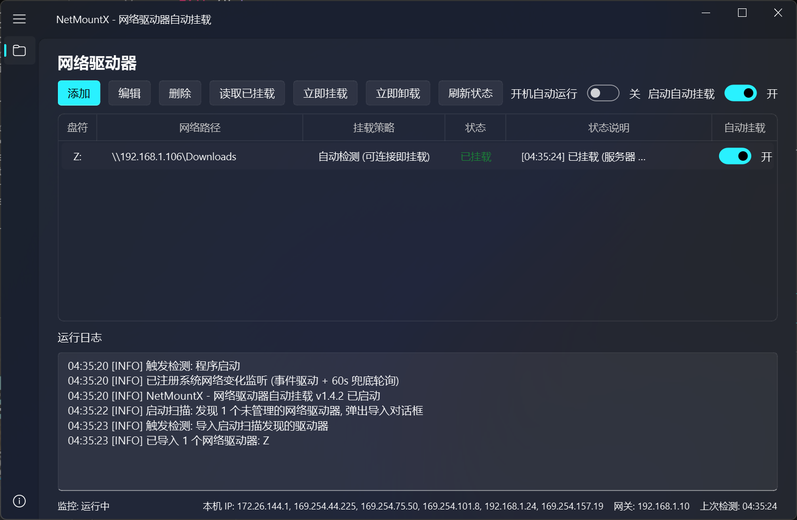

<p align="center">
  
</p>

<h1 align="center">NetMountX</h1>

<p align="center">
  <strong>Windows 网络驱动器自动挂载/卸载工具</strong>
</p>

<p align="center">
  切换网络 → 自动检测 → 自动挂载 · 离开网络 → 自动卸载
</p>

---

## 截图

<p align="center">
  
</p>

## 功能

- **网络感知** — 监听系统网络变化（IPHLPAPI 事件 + 兜底轮询），切换网络后立即检测
- **自动挂载/卸载** — 驱动器服务器在同网络可连接时自动挂载，离开网络时自动卸载
- **严格子网模式** — 可选同一子网 + SMB 端口实测，避免搬到同网段另一网络（如家里和公司都是 192.168.1.x）时误判
- **凭据安全** — 密码通过 `cmdkey` 存入 Windows 凭据管理器，配置文件不保存明文密码
- **开机自启** — 注册表 `HKCU Run` 键，无需管理员权限
- **启动扫描** — 每次启动时扫描系统中未被管理的网络驱动器，弹出导入对话框
- **灵活控制** — 全局/每盘独立自动挂载开关，手动挂载不受影响
- **状态追踪** — 点击状态列弹出详情窗口，包含最近 50 条状态记录
- **系统托盘** — 关闭窗口即最小化到托盘，后台持续监控

## 安装

### 方式一：直接运行（源码）

```bash
# 1. 安装依赖
pip install PyQt6-Fluent-Widgets

# 2. 启动
python netmountx.py
# 或
python -m NetMountX

# 3. 开机最小化启动
python -m NetMountX --minimized

# 4. 运行自检
python -m NetMountX --selftest
```

### 方式二：打包为 exe

```bash
# 1. 安装打包工具
pip install pyinstaller PyQt6-Fluent-Widgets

# 2. 一键打包
build_exe.bat

# 3. 产物: dist\NetMountX.exe（单文件，可直接运行）
```

## 命令行

| 参数 | 说明 |
|------|------|
| （无） | 启动 GUI 主界面 |
| `--minimized` | 启动后最小化到系统托盘（供开机自启使用） |
| `--selftest` | 运行自检（不启动 GUI，无需 GUI 依赖） |

## 配置

- 配置文件：`%APPDATA%\NetMountX\config.json`（不含密码）
- 日志文件：`%APPDATA%\NetMountX\netmountx.log`

## 项目结构

```
NetMountX/
├── netmountx.py                # 启动入口
├── build_exe.bat               # Windows 一键打包脚本
├── icon.png                    # 应用图标
├── pic.png                     # 软件截图
│
└── NetMountX/                  # Python 包
    ├── __init__.py             # 版本号、路径、公共工具
    ├── __main__.py             # 命令行入口
    ├── constants.py            # 枚举常量（DriveMode / DriveState）
    ├── core.py                 # 底层工具（WNet API / 网络检测 / 挂载）
    ├── config.py               # 配置管理（JSON 读写）
    ├── monitor.py              # 后台监控引擎（网络监听 + 调和）
    ├── autostart.py            # 开机自启 + 旧版迁移
    ├── gui.py                  # GUI（PyQt6 + Fluent-Widgets）
    ├── selftest.py             # 自检
    └── netmountx.ico           # 图标（用于打包 exe）
```

## 技术栈

- **语言**：Python 3.13+
- **GUI**：[PyQt-Fluent-Widgets](https://github.com/zhiyiYo/PyQt-Fluent-Widgets) — Fluent Design 风格
- **打包**：PyInstaller（单文件 exe，无控制台窗口）
- **网络检测**：IPHLPAPI + SMB 端口探测 + 子网匹配

## 许可证

MIT
